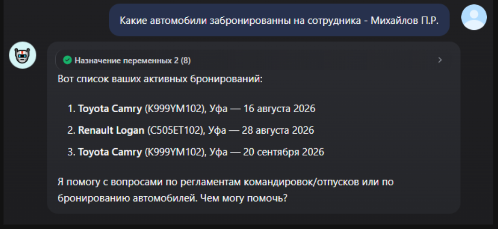
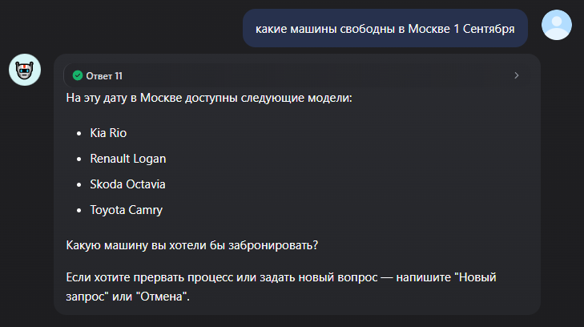
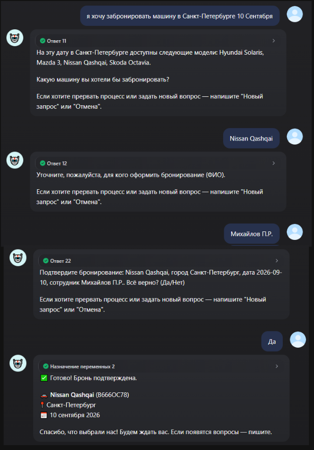
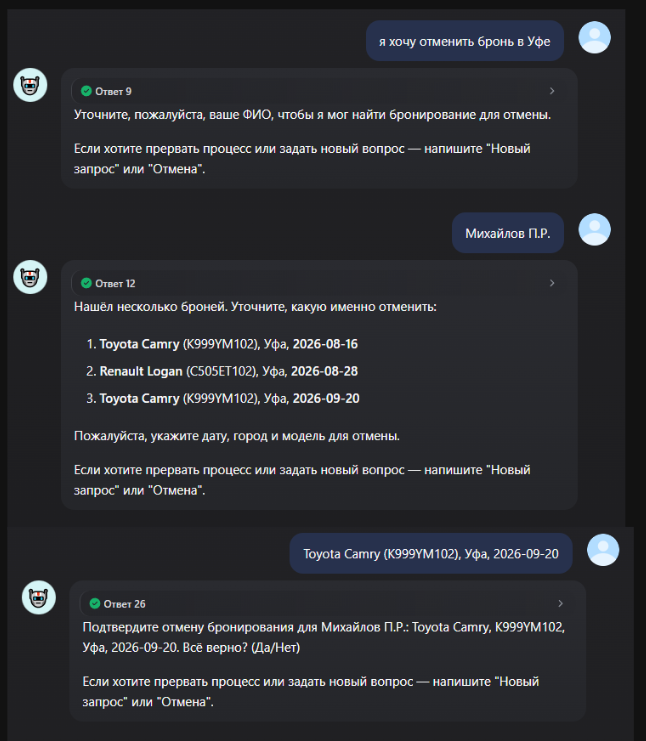
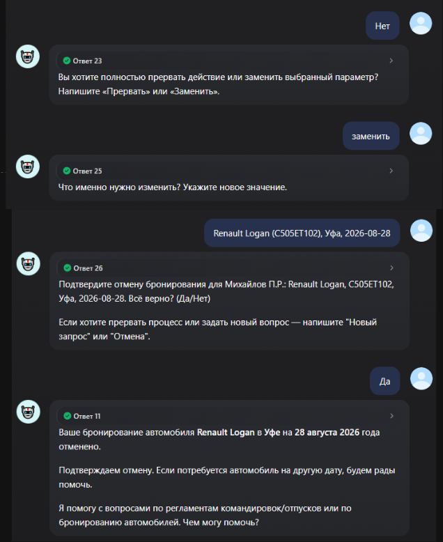
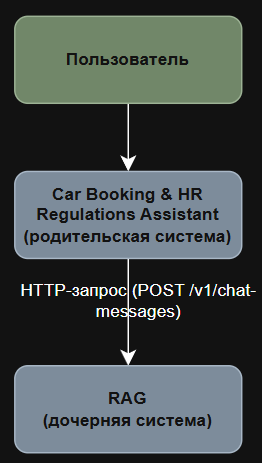
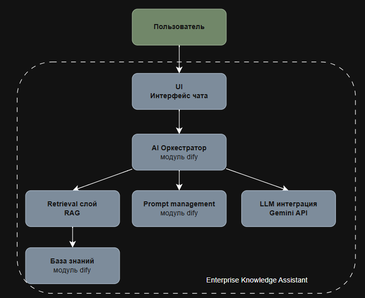

  
# 🤖 Car Booking & HR Regulations Assistant

### Корпоративный AI-ассистент для работы с внутренними регламентами и бронированием корпоративных автомобилей

> **Pet-проект**, разработан и полностью задокументирован в одиночку — как демонстрация практического владения оркестрацией AI-агентов, проектированием БД и инженерным подходом к надёжности LLM-систем.

Проект включает **два сценария** в одном диалоговом интерфейсе:

1. **RAG-ассистент по HR-регламентам** — отвечает на вопросы сотрудников на основе внутренних нормативных документов компании (командировки, отпуска).
2. **Ассистент по бронированию служебных автомобилей** — поиск свободных машин, бронирование, отмена, просмотр текущих броней — всё в свободном диалоге.

Технически — это Dify Chatflow, работающий поверх базы данных Supabase (PostgreSQL), с бизнес-логикой, вынесенной на уровень БД через RPC-функции.

> **Актуальная версия бота**: [https://udify.app/chat/pDrd8Z2oX8xg0ZK8](https://udify.app/chat/pDrd8Z2oX8xg0ZK8)

---

## О проекте

Проект решает две ключевые бизнес-задачи: быстрый и точный поиск ответов по внутренним регламентам компании с помощью RAG, а также удобное управление корпоративным автопарком — поиск свободных автомобилей, просмотр текущих броней, оформление и отмена бронирования через естественный язык.

Бизнес-задачи:
- в крупных компаниях корпоративный автопарк может включать десятки и сотни автомобилей, а процесс бронирования часто разрознен: таблицы, чаты, почта, разные системы учёта. Из-за этого сотрудники тратят время на выяснение, свободна ли нужная машина, кто её уже забронировал, и могут ли они оформить бронь на конкретную дату и город. Ошибки и пересечения броней приводят к простоям и конфликтным ситуациям;
- в крупных компаниях внутренние регламенты могут занимать сотни и тысячи страниц. Поиск информации традиционными средствами занимает много времени и часто возвращает целый документ вместо конкретного ответа.

Цели проекта:
- показать, как RAG позволяет находить только релевантные фрагменты документов и формировать точный ответ на их основе, а не отдавать пользователю весь регламент;
- показать, как связка разговорного интерфейса, последовательного сбора параметров позволяет сотруднику управлять бронированием автомобилей естественным языком: система уточняет недостающие данные, формирует корректные SQL-запросы к базе и выполняет операции (поиск, создание и отмену броней) без необходимости работать напрямую с таблицами или формами.

---

## Что умеет бот

- Система отвечает только в рамках заданных сценариев и не реагирует на посторонние вопросы

  

- Система не выдумывает ответы

  

### 💬 Вопросы по регламентам (RAG)

Отвечает на основе реальных документов компании, с явной защитой от **галлюцинаций** — если точного ответа в документах нет, бот честно об этом говорит, а не фантазирует правдоподобные цифры.

- какой лимит гостиницы предусмотрен при зарубежной командировке;
- кто должен согласовать командировку стоимостью 100 000 рублей;
- за сколько дней нужно подать заявление на отпуск;
- можно ли разделить ежегодный отпуск на несколько частей.

В текущей версии используются два документа:

| Документ | Документ | Адаптированная версия|
|----------|----------|----------|
| Регламент оформления командировок |‼️  | ‼️ |
| Регламент предоставления отпусков |‼️  | ‼️ |

- Работа системы с Регламентом оформления командировок

  

- Работа системы с Регламентом предоставления отпусков

  

### 🚙 Бронирование машин

- какие автомобили свободны в Москве на 20 августа;
- какие автомобили забронированны на сотрудника - Михайлов П.Р.;
- забронировать Toyota Camry для Петрова на 25 августа в Санкт-Петербурге;
- отменить Toyota Camry для сотрудника - Иванов И.И. в городе Уфа на 1 Сентября;

####   Примеры работы системы:

- Работа системы с получением списка забронированных автомобилей по пользователю

  

- Работа системы с получением списка свободных для бронирования автомобилей по городу и дате

  

- Работа системы в процессе бронирования автомобиля

  

- Работа системы в процессе отмены бронирования автомобиля

  

  

---

## Инженерные решения, которые здесь стоит посмотреть

Это не просто «обёртка над LLM» — большая часть проекта посвящена тому, чтобы сделать систему, построенную на вероятностных компонентах, **предсказуемой**:

- **Атомарное бронирование под нагрузкой.** Функция `reserve_available_car` использует `pg_advisory_xact_lock` + `FOR UPDATE SKIP LOCKED`, чтобы два одновременных запроса на бронирование гарантированно не забрали одну и ту же машину — без ошибок из-за гонки.
- **Явное состояние диалога вместо LLM-памяти.** После серии найденных на практике сбоев (зацикливание, неверная классификация коротких ответов) вся смысловая непрерывность многошаговых сценариев переведена на явные Conversation Variables с детерминированной merge-логикой — не на «память» модели.
- **Guard Rail перед необратимыми действиями.** Бронирование и отмена брони требуют явного текстового подтверждения перед выполнением — с корректной обработкой «Да/Нет/Прервать/Заменить» и восстановлением состояния при неоднозначном ответе.
- **Защита от галлюцинаций в RAG.** Порог релевантности поиска + явная проверка «ничего не найдено» до вызова LLM — модель физически не может ответить, если контекста нет.
- **Комбинированный аудит.** Мутации данных логируются через триггер БД (гарантированное покрытие), обращения на чтение — явным вызовом из pipeline (СУБД не может перехватывать `SELECT` триггером — пришлось решать на уровне приложения).
- **Fail-safe интеграции.** Любой сбой связи с БД возвращает пользователю понятное сообщение, а не рушит диалог молча.

---

## Технологический стек

| Технология | Назначение |
|------------|------------|
| **Dify** (Chatflow) | Платформа для построения AI Workflow — оркестрация диалога, маршрутизация намерений, RAG-пайплайн, интеграция с внешними API |
| **PostgreSQL / Supabase** | Источник истины для данных — нормализованная схема, ENUM-типы, партиционированные уникальные индексы, триггеры |
| **PL/pgSQL** | Бизнес-логика на уровне БД — атомарные транзакции, `SECURITY DEFINER`-функции, защита от race condition через `FOR UPDATE SKIP LOCKED` и advisory locks |
| **Deepseek** | Большая языковая модель для генерации ответов |
| **Gemini Embeddings** | Векторизация документов |
| **Knowledge Base (Dify)** | Хранение корпоративных документов |
| **Vector Database** | Семантический поиск |
| **JavaScript** | Вся логика в Code-узлах Dify — нормализация дат, валидация вывода LLM, управление состоянием диалога |
| **REST API (PostgREST)** | Вызов серверной бизнес-логики (RPC) напрямую из Dify через HTTP-узлы |
| **Row Level Security** | Защита данных на уровне БД, независимо от логики приложения |
| **Git** | Контроль версий |

---

## Архитектура — родительское приложение + дочернее

Проект разделён на два независимых Dify-приложения:

  

**Почему RAG вынесен, а booking — нет.** RAG stateless по своей природе (каждый вопрос самодостаточен, не требует памяти между сообщениями) — разделение потребовало только передачи текста вопроса, без состояния. Booking, напротив, построен на многошаговом диалоговом состоянии (session lock, Guard Rail-подтверждение, накопление параметров между сообщениями) — вынос в отдельное приложение потребовал бы либо полной передачи состояния через границу HTTP на каждый ход, либо поддержки Dify длящейся сессии дочернего приложения, что не подтверждено платформенно. Решение отложено после оценки трудозатрат — см. `ADR-032` в [ADR-логе](docs/adr-log.md).

Схема подсистемы работы с регламентами (RAG) :

  

---

## Подходы и методики, реализованные в этом проекте

Короткая расшифровка терминов, что каждый из них означает и где именно в проекте реализован. Полная версия с подробными объяснениями и перекрёстными ссылками на ADR — в [Glossary](docs/06_Glossary.md).

| Термин | Где реализовано |
|--------|-----------------|
| **Архитектура** | Слоистая система: диалог (Dify) → бизнес-логика (PostgreSQL-функции) → данные. 25+ задокументированных архитектурных решений в ADR-логе |
| **Интеграции** | REST API-интеграция с Supabase через собственный RPC-слой; задокументирован переход от готового плагина к прямым HTTP-вызовам после обнаружения его ограничений |
| **Управление состоянием (State Management)** | Явные Conversation Variables вместо LLM-памяти — город, дата, модель, ФИО сохраняются по ходу всего диалога |
| **State Machine** | Guard Rail-подтверждение перед бронированием/отменой — формальные состояния и переходы между ними (confirm → choice → replace → confirm) |
| **Маршрутизация запросов (Intent Routing)** | Двухуровневая классификация намерений с защитой от ошибочной маршрутизации LLM |
| **Intent Map** | Для каждого из 4 намерений явно определены обязательные параметры, fallback при их нехватке и переход дальше |
| **Tool Calling** | 8 серверных функций (RPC) — модель вызывает их для проверки доступности, бронирования, поиска и отмены брони вместо того, чтобы придумывать ответ |
| **Guardrails** | Запрет модели придумывать факты вне документов; запрет самостоятельно завершать мутацию без подтверждения; код-валидация вывода LLM на каждом шаге |
| **Source of Truth** | База данных — единственный источник истины; явно разграничено, что решает модель, а что обязано идти через реальную проверку в БД |
| **Отказоустойчивость** | Fail-branch на всех вызовах к БД; защита от гонки при параллельном бронировании |
| **Безопасность** | Row Level Security, разделение прав доступа, полный журнал аудита действий и запросов |
| **Комбинированный аудит** | Таблица `audit_log` — фиксирует мутации (через триггер БД) и обращения на чтение (явным вызовом), включая неудачные попытки |
| **Обработка ошибок API** | Каждый вызов к Supabase имеет отдельную ветку обработки сбоя с понятным сообщением пользователю |
| **Тестовые сценарии** | 50+ задокументированных тестов — от happy path до пограничных случаев и сбоев инфраструктуры |
| **Prompt Engineering** | Итеративно усиленные инструкции для моделей — задокументированы конкретные случаи, где первая версия промпта была ненадёжной, и как это исправлялось |
| **RAG** | Ответы по регламентам строятся на реальных документах с настроенным порогом релевантности и защитой от ответа без источника |
| **Архитектура агентов / Tools** | Полноценная агентная схема: модель определяет намерение и параметры, специализированные инструменты выполняют реальные действия |
| **Матрица ответственности LLM/API** | Явно прописано в архитектуре: LLM понимает язык и формулирует ответ, код и БД проверяют факты и выполняют мутации |
| **Атомарное бронирование под нагрузкой** | Функция `reserve_available_car` использует `pg_advisory_xact_lock` + `FOR UPDATE SKIP LOCKED`, чтобы два одновременных запроса на бронирование гарантированно не забрали одну и ту же машину — без ошибок из-за гонки. |
| **Session Lock / Finite State Machine** | Диалог удерживает пользователя в активном сценарии до явного завершения (успех, команда сброса, ошибка) — LLM-классификатор намерений физически не вызывается, пока сценарий активен, что структурно исключает целый класс ошибок маршрутизации, а не патчит их по одному найденному случаю. |
| **Явное состояние диалога вместо LLM-памяти** | Вся смысловая непрерывность многошаговых сценариев построена на явных Conversation Variables с детерминированной merge-логикой — не на «память» модели. |
| **Защита от галлюцинаций в RAG** | Порог релевантности поиска + explicit-проверка «ничего не найдено» до вызова LLM. |
| **Fail-safe интеграции** | Любой сбой связи с БД возвращает пользователю понятное сообщение, а не рушит диалог молча. |

  

---

## Архитектурные паттерны, применённые в проекте

Короткая расшифровка — что означает каждый термин и где он реализован. Подробный глоссарий с объяснениями «для непосвящённых» — в [Glossary](docs/06_Glossary.md).

| Паттерн | Статус | Где реализовано / почему отложено |
|---|---|---|
| **Finite State Machine / Session Lock** | ✅ Реализовано | Единая блокировка активного сценария (`conv_active_branch`/`conv_branch_step`) вместо многоуровневой системы приоритетов классификации — `ADR-027` |
| **Command Pattern** | ✅ Реализовано | Каждая мутация собирается как самостоятельный объект-команда (параметры + валидация) до момента исполнения, отделённого Guard Rail-подтверждением — `ADR-029` |
| **Repository Pattern** | ✅ Реализовано | Единая точка доступа к данным через RPC-слой, ни один узел pipeline не обращается к таблицам напрямую — `ADR-030` |
| **Guardrails** | ✅ Реализовано | Запрет модели придумывать факты вне документов; валидация вывода LLM кодом на каждом шаге; мутация только после подтверждения |
| **Source of Truth** | ✅ Реализовано | База данных — единственный источник истины; явно разграничено, что решает модель, а что обязано идти через реальную проверку в БД |
| **Микросервисная декомпозиция (частично)** | ✅ Реализовано (RAG) / ⚠️ Отложено (Booking) | RAG вынесен в отдельное stateless-приложение; booking остался монолитным из-за сложности переноса stateful-сессии — `ADR-032` |
| **Idempotency Key** | ⛔ Рассмотрено, отклонено | Риск дублирующей мутации уже смягчён `unique_active_booking` индексом и advisory lock; отдельный ключ признан избыточным при текущем масштабе — `ADR-028`-смежное решение |
| **Correlation ID / Distributed Tracing** | ⛔ Рассмотрено, отклонено | Решено не реализовывать; альтернативная трассировка через `actor` + временную близость записей в `audit_log` — `ADR-031` |
| **Circuit Breaker** | ⛔ Рассмотрено, не реализовано | Требует состояния, живущего между сессиями разных пользователей — не ложится естественно на Conversation Variables |
| **Saga / Compensating Transaction** | ⛔ Рассмотрено, не актуально | Вся мутация — одна Postgres-транзакция, паттерн решает проблему нескольких независимых систем, которой пока нет |
| **Outbox Pattern** | ⛔ Рассмотрено, не реализовано | Правильное развитие аудит-логирования при повышении критичности; несоразмерная сложность для текущего масштаба |

---

## Что было реализовано

В ходе разработки были решены практические задачи, типичные для корпоративных AI-систем:

- подготовка документов для RAG;
- исследование влияния разных стратегий Chunking;
- сравнение качества обработки различных документов;
- настройка Retrieval;
- проектирование модели метаданных;
- фильтрация документов по метаданным;
- функциональное тестирование системы;
- проектирование нормализованной схемы БД под многошаговый бизнес-процесс;
- вынесение бизнес-логики на уровень БД (RPC, атомарные транзакции);
- защита от race condition при параллельных запросах (advisory lock, `FOR UPDATE SKIP LOCKED`);
- проектирование state machine для многошагового диалога (session lock, Guard Rail);
- управление диалоговым состоянием без опоры на память LLM;
- маршрутизация намерений и защита от ошибочной классификации;
- проектирование Guard Rail-подтверждения перед необратимыми действиями;
- настройка Row Level Security и разграничения доступа;
- построение комбинированного аудит-логирования (мутации + обращения на чтение);
- обработка сбоев внешних интеграций (fail-safe, понятные сообщения об ошибках);
- итеративное функциональное тестирование системы (50+ сценариев, включая пограничные случаи).

---

## Документация проекта

В репозитории представлены основные проектные документы:

| Документ | Что внутри |
|----------|------------|
| `01_Project Overview and Vision.md` | Что это, зачем, ключевые сценарии |
| `02_Architecture Overview.md` | Полная техническая схема — БД, RPC-слой, pipeline, управление состоянием |
| `03_Architecture Decision Records.md` | История архитектурных решений — что рассматривалось, что выбрано и почему (включая отклонённые варианты) |
| `04_API Contract.md` | Контракт всех RPC-функций Supabase — параметры, edge cases, примеры |
| `05_Test Plan.md` | Свод тестовых сценариев с ожидаемыми результатами |
| `06_Glossary.md` | Подробный глоссарий терминов с перекрёстными ссылками на ADR |

Документация RAG-приложения — отдельно, в его собственном репозитории/README.

Это показывает, что проект создавался как полноценное инженерное решение, а не только как демонстрация возможностей AI.

---

## Почему стоит посмотреть ADR-лог отдельно

Если из всего проекта читать только один документ — это он. Там разобраны реальные инженерные тупики и то, как они решались: почему LLM-память оказалась ненадёжной для многошаговых сценариев, почему объединили два намерения в одно после редизайна БД, почему отказались от готового плагина в пользу RPC, почему один платформенный баг заставил переделать Guard Rail на лету, почему разделение на микросервисы было доведено до RAG, но не до booking. Это живой процесс принятия решений, а не только финальный результат — больше 30 записей, включая отклонённые варианты с честным обоснованием, почему они отклонены.

Ознакомиться с [ADR](docs/03_Architecture_Decision_Records.md)

---

## Живая демонстрация

‼️ *[Место для ссылки на опубликованное Dify-приложение — вставить после финальной проверки актуальности тестовых данных]*

---

## Автор

Разработано как практический проект для перехода в сторону AI-solutions-архитектуры — с бэкграундом системного анализа (18 лет на стыке IT и бизнеса, 5+ лет — системный анализ на high-load корпоративных системах, домен fintech/ERP).

---

## Лицензия

Учебный проект, разработанный в рамках формирования портфолио по проектированию корпоративных AI-решений.

---

Сделано с ❤️ и 🤖 для изучения AI-инженерии

