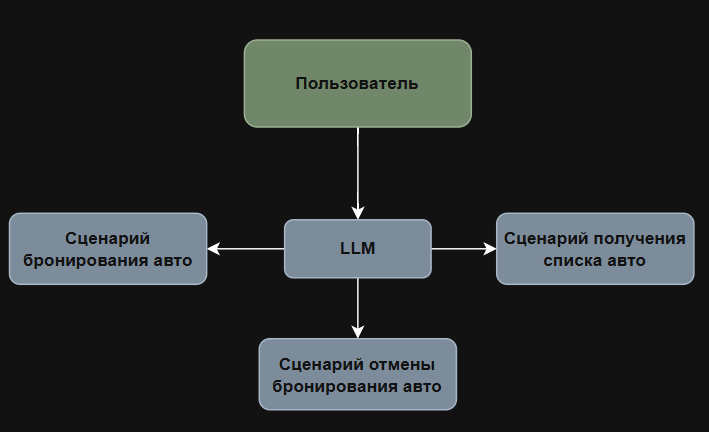
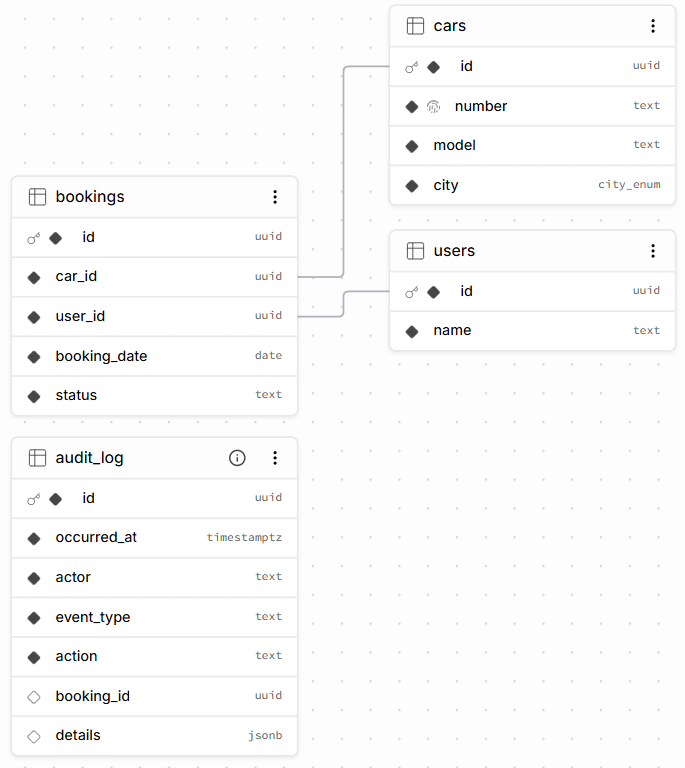
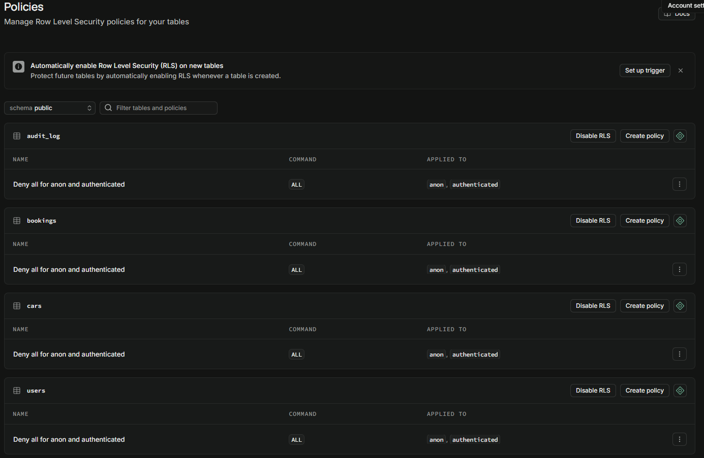
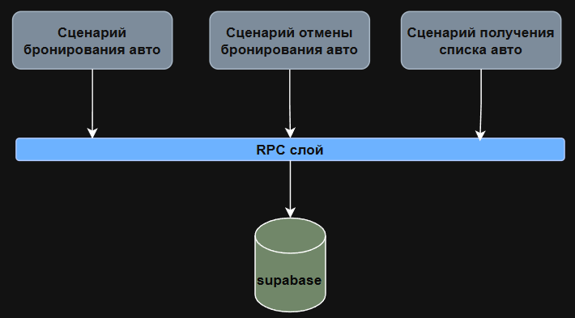
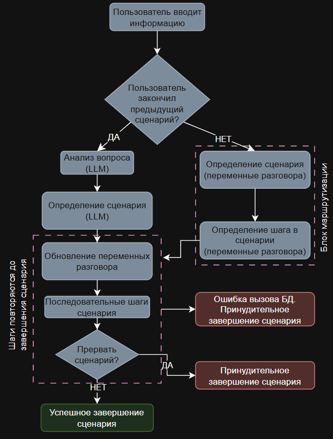
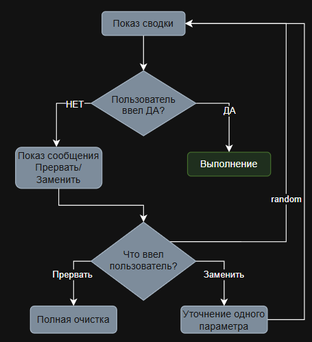
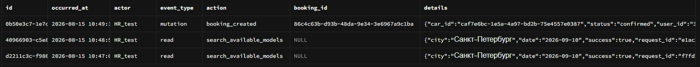

# Architecture Overview — Car Booking Assistant (Parent Application)

*Документ описывает архитектуру родительского приложения — систему бронирования служебных автомобилей. Документация RAG-подсистемы (вопросы по регламентам) вынесена в отдельный проект и не описывается здесь, кроме точки интеграции.*

---

## 1. Общая картина

Система состоит из двух независимых Dify-приложений:

- **Родительское приложение** (этот документ) — ведёт весь диалог с пользователем, включая маршрутизацию намерений, полный цикл бронирования/отмены/просмотра броней автомобилей, обращения к Supabase.
- **Дочернее приложение (RAG)** — отдельный проект, отвечает на вопросы по регламентам командировок/отпусков. Вызывается родительским приложением через HTTP как внешний сервис, документируется отдельно.

Разделение проведено по признаку stateless/stateful: RAG не требует памяти между сообщениями, поэтому вынесен без сложностей. Booking полностью построен на многошаговом диалоговом состоянии — решение оставить его в родительском приложении, а не выносить аналогично RAG, обосновано в `ADR-032`.

<p align="center">
  
</p>

#### В системе бронирования предусмотрены три основных сценария

<p align="center">
  
</p>

---

## 2. База данных (Supabase)

### Схема

<p align="center">
  
</p>

### Создание БД, описание таблиц, полей и связей

```sql
-- ============================================
-- ШАГ 1. ENUM для города
-- ============================================

CREATE TYPE city_enum AS ENUM ('Москва', 'Санкт-Петербург', 'Уфа');

-- ============================================
-- ШАГ 2. Таблица cars
-- ============================================

CREATE TABLE public.cars (
    id      uuid PRIMARY KEY DEFAULT gen_random_uuid(),
    number  text NOT NULL UNIQUE,
    model   text NOT NULL,
    city    city_enum NOT NULL
);

-- гарантируем единый регистр номера прямо на уровне БД —
-- дублирует вашу нормализацию в коде Dify, но защищает от случаев,
-- если данные когда-нибудь попадут в таблицу в обход pipeline
ALTER TABLE public.cars
    ADD CONSTRAINT number_uppercase_check CHECK (number = upper(number));

-- индекс под частый фильтр "машины в городе X"
CREATE INDEX idx_cars_city ON public.cars (city);


-- ============================================
-- ШАГ 3. Таблица users
-- ============================================

CREATE TABLE public.users (
    id    uuid PRIMARY KEY DEFAULT gen_random_uuid(),
    name  text NOT NULL
);

-- намеренно НЕТ UNIQUE на name — по вашему решению,
-- разное написание имени считается разными записями


-- ============================================
-- ШАГ 4. Таблица bookings
-- ============================================

CREATE TABLE public.bookings (
    id            uuid PRIMARY KEY DEFAULT gen_random_uuid(),
    car_id        uuid NOT NULL REFERENCES public.cars(id),
    user_id       uuid NOT NULL REFERENCES public.users(id),
    booking_date  date NOT NULL,
    status        text NOT NULL DEFAULT 'confirmed'
                  CHECK (status IN ('confirmed', 'cancelled'))
);

-- индексы под частые фильтры
CREATE INDEX idx_bookings_car_id ON public.bookings (car_id);
CREATE INDEX idx_bookings_user_id ON public.bookings (user_id);
CREATE INDEX idx_bookings_booking_date ON public.bookings (booking_date);

-- защита от двойного бронирования на уровне БД:
-- не может быть двух confirmed-записей на одну машину/дату одновременно
CREATE UNIQUE INDEX unique_active_booking
    ON public.bookings (car_id, booking_date)
    WHERE status = 'confirmed';

-- ============================================
-- ШАГ 5. Таблица audit_log
-- ============================================

CREATE TABLE public.audit_log (
    id           uuid PRIMARY KEY DEFAULT gen_random_uuid(),
    occurred_at  timestamptz NOT NULL DEFAULT now(),
    actor        text NOT NULL DEFAULT 'HR_test',
    event_type   text NOT NULL CHECK (event_type IN ('read', 'mutation')),
    action       text NOT NULL,
    booking_id   uuid,
    details      jsonb
);

CREATE INDEX idx_audit_log_occurred_at ON public.audit_log (occurred_at);
CREATE INDEX idx_audit_log_booking_id ON public.audit_log (booking_id);
CREATE INDEX idx_audit_log_actor ON public.audit_log (actor);

```

### Ключевые решения

- **`city`** — PostgreSQL ENUM (`Москва`/`Санкт-Петербург`/`Уфа`), не отдельная таблица.
- **`users.name`** — без нормализации, без уникальности; поиск строго по точному совпадению строки. Отражает отсутствие полноценной авторизации.
- **Партиционированный уникальный индекс** `unique_active_booking (car_id, booking_date) WHERE status = 'confirmed'` — гарантия на уровне БД против двух активных броней на одну машину/дату.
- **Триггер + advisory lock** — бизнес-правило «один сотрудник — максимум одна активная бронь в городе на дату» реализовано в двух местах: BEFORE-триггер на `bookings` (ловит любой путь записи) и `pg_advisory_xact_lock` внутри `reserve_available_car` (защита от гонки параллельных запросов).
- **`created_at`/`updated_at`** — отсутствуют в `cars`/`users`/`bookings`, есть только в `audit_log`.

### Row Level Security

Включён на всех таблицах. Явные deny-политики (`USING (false)`) для `anon`/`authenticated`. Весь легитимный доступ — через `service_role` (обходит RLS по определению); RPC-функции с `SECURITY DEFINER` также обходят RLS. Защита нацелена на гипотетическую утечку `anon`-ключа, не на текущий рабочий путь.

<p align="center">
  
</p>

---

## 3. RPC-слой (Repository Pattern)

Весь доступ к данным из pipeline идёт исключительно через именованные PostgreSQL-функции (`SECURITY DEFINER`, явный `search_path`), вызываемые через HTTP-узлы Dify. Ни один узел приложения не выполняет прямой SELECT/INSERT/UPDATE к таблицам — единственное исключение зафиксировано явно: BEFORE/AFTER-триггер на `bookings` обращается к данным напрямую, но является частью уровня данных, а не приложенческого кода (`ADR-030`).

<p align="center">
  
</p>

| Функция | Назначение |
|---|---|
| `get_available_models` | Список моделей, свободных в городе на дату |
| `get_one_available_car` | Одна свободная машина модели (не атомарна, в pipeline не используется) |
| `reserve_available_car` | Атомарный поиск + бронирование (advisory lock + `FOR UPDATE SKIP LOCKED`) |
| `get_user_active_bookings` | Активные брони сотрудника (текущие и будущие) |
| `find_booking_to_cancel` | Поиск брони для отмены по частичным параметрам |
| `cancel_booking` | Отмена конкретной брони по id |
| `expire_past_bookings` | Служебная — переводит просроченные брони в cancelled, запускается через `pg_cron` |
| `log_read_event` | Запись read-события в audit_log |

Полные сигнатуры — в [04_API_Contract](04_API_Contract.md)

---

## 4. Управление диалогом — Finite State Machine / Session Lock

Центральное архитектурное решение системы (`ADR-027`). Пришел к нему после серии обнаруженных на практике сбоев маршрутизации при более ранней модели (многоуровневые приоритеты классификации, `ADR-012`/`ADR-016`/`ADR-019`, впоследствии заменённые).

### Принцип

Пока пользователь находится в активном сценарии (бронирование, отмена, просмотр броней), LLM-классификатор намерений **не вызывается вообще**. Каждое сообщение направляется напрямую во внутренний роутер активной ветки.

### Ключевые переменные состояния

| Переменная | Назначение |
|---|---|
| `conv_active_branch` | Какая ветка активна: `reserve` / `cancel` / `my_bookings` / пусто |
| `conv_branch_step` | Этап внутри ветки: `collecting` / `confirming` / `choosing` |
| `conv_reserve_city/date/model` | Параметры текущего reserve-сценария |
| `conv_cancel_city/date/model` | Параметры текущего cancel-сценария (разделены с reserve — `ADR-016`, защита от утечки данных между сценариями одного типа, разнесёнными во времени; рассмотрено и отклонено объединение — `ADR-028`) |
| `conv_employee_name` | ФИО — общее для всех сценариев, не сбрасывается между ними |
| `conv_pending_booking_id` | id найденной для отмены брони |
| `conv_confirm_state` | Конкретное состояние подтверждения (`reserve_confirm`/`cancel_confirm`/`reserve_choice`/`cancel_choice`) — используется для различения reserve/cancel внутри общего confirmation-обработчика |
| `conv_confirm_summary` | Текст подтверждения — хранится в Conversation Variable, а не в локальном выводе блока, для корректного повторного показа при неоднозначном ответе |

### Условия выхода из активной ветки

1. Явная команда пользователя («Новый запрос» / «Отмена»)
2. Успешное завершение сценария
3. Ошибка выполнения (сбой инфраструктуры)

Все три ведут в единый блок очистки состояния (`ADR-024`), сбрасывающий полный набор conv-переменных.

<p align="center">
  
</p>

### Механизм накопления параметров (merge)

Каждый экстрактор параметров сопровождается Code-блоком: новое значение из текущего сообщения побеждает, если оно непусто, иначе сохраняется предыдущее из Conversation Variable. LLM-память в экстракторах отключена — вся смысловая непрерывность обеспечивается этим механизмом, не «памятью» модели (`ADR-026`).

---

## 5. Guard Rail — подтверждение перед мутацией

Перед `reserve_available_car` и `cancel_booking` пользователь обязан явно подтвердить действие (`ADR-025`). Реализовано как текстовый диалог (не встроенный Dify-узел Human Input — отклонён из-за платформенного бага при публикации графа, `ADR-013`):

<p align="center">
  
</p>

Ответы пользователя разбираются детерминированным Code-блоком (точное совпадение «да»/«нет»/«прервать»/«заменить»), не LLM — предсказуемость на критичном пути перед мутацией.

---

## 6. Command Pattern

Каждая мутация (бронирование, отмена) оформлена как самостоятельный объект-команда: параметры собираются и валидируются в отдельном Code-блоке до вызова RPC, а само выполнение отделено от сборки шагом Guard Rail-подтверждения (`ADR-029`). Между сборкой и выполнением команда хранится в Conversation Variables.

---

## 7. Надёжность и обработка ошибок

- **Fail Branch** на всех HTTP-узлах, вызывающих Supabase RPC — сбой инфраструктуры не роняет workflow, ведёт к понятному сообщению пользователю. Default Value намеренно не используется — не маскирует сбой инфраструктуры под пустой бизнес-результат.
- **Валидация вывода LLM кодом** — на каждом уровне классификации вывод модели проверяется по allowed-list с защитным fallback.
- Рассмотрены и осознанно не реализованы: Idempotency Key (риск дублирующей мутации уже смягчён уникальным индексом и advisory lock), Correlation ID/Distributed Tracing (`ADR-031`), Circuit Breaker, Saga, Outbox — обоснование каждого в ADR-логе.

---

## 8. Наблюдаемость (Audit Log)

Единая таблица `audit_log`, комбинированный подход (`ADR-023`):
- **Мутации** — через BEFORE/AFTER-триггер на уровне БД, гарантированное покрытие независимо от пути записи.
- **Обращения на чтение** — через явный вызов `log_read_event` из pipeline после каждого read-RPC (успех и сбой) — Postgres не поддерживает триггеры на SELECT.

`actor` — захардкоженное системное значение (`HR_test`), не криптографически подтверждённая идентификация — авторизации в системе нет.

<p align="center">
  
</p>

---

## 9. Осознанно не реализовано

- Полноценная авторизация / привязка `user_id` к диалогу
- Идемпотентность на случай повторной отправки подтверждения
- RLS-политики с содержательной фильтрацией (только deny-all на сегодня)
- Correlation ID для сквозной трассировки мутаций (частично реализовано только для read-событий)
- Вынос booking-логики в отдельное дочернее приложение (`ADR-032`)
- TTL / автоматическая очистка состояния диалога при длительном бездействии пользователя

Подробности и обоснование каждого решения — в [ADR](03_Architecture_Decision_Records.md)-логе проекта
